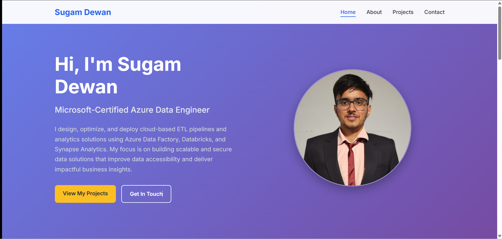

# Sugam Dewan - Personal Portfolio Website

This repository contains the source code for my professional portfolio website. The site is fully responsive and showcases my skills, projects, and professional experience as an Azure Data Engineer.

### ✨ **Live Website**

You can view the live version of the site here: **[https://SugamDewan.github.io](https://SugamDewan.github.io)**

### 🚀 Technologies Used

The website is built using fundamental web technologies:

* **HTML5:** For the structure and content.
* **CSS3:** For all styling, layout, and responsive design.
* **JavaScript:** For interactive elements, such as the mobile navigation menu.

### 📸 Screenshot

